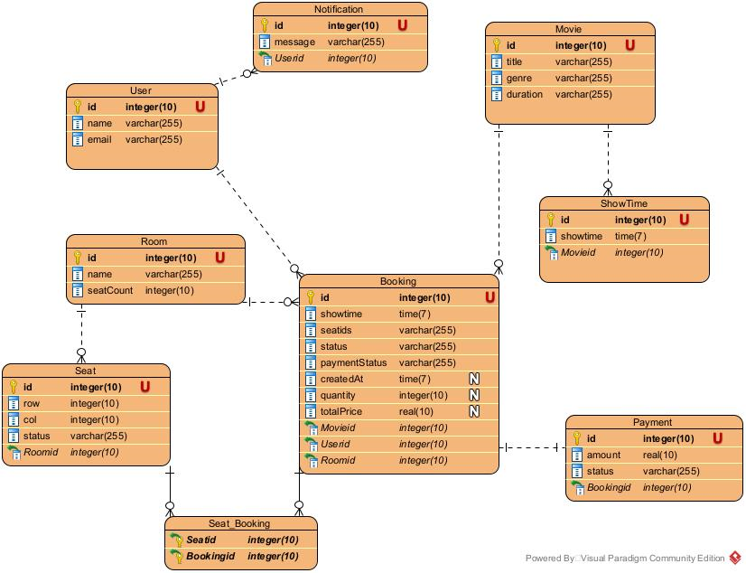

# **Microservices System - Analysis and Design**

---

## 1. 🎯 Problem Statement (Mô tả Bài toán)

**Vấn đề hệ thống giải quyết (Problem Description):**

Hệ thống giải quyết sự bất tiện và tốn thời gian của việc mua vé xem phim theo cách truyền thống. Khách hàng thường phải đến trực tiếp rạp chiếu phim để xem lịch chiếu, chọn ghế và mua vé, dẫn đến việc phải xếp hàng chờ đợi, đặc biệt vào giờ cao điểm hoặc khi có phim bom tấn. Hơn nữa, họ có nguy cơ không mua được vé hoặc không chọn được ghế ngồi mong muốn nếu đến muộn. Hệ thống đặt vé xem phim trực tuyến ra đời nhằm loại bỏ những trở ngại này, mang lại trải nghiệm đặt vé nhanh chóng, tiện lợi và đảm bảo hơn, cải thiện trải nghiệm thuận tiện cho khách hàng.

**Người dùng (Users):**

Hệ thống có hai nhóm người dùng chính:

1. **Khách hàng (End-users/Customers):** Những người muốn tìm kiếm thông tin phim, xem lịch chiếu, chọn ghế và đặt vé xem phim trực tuyến một cách dễ dàng.
2. **Quản trị viên/Nhân viên rạp (Administrators/Cinema Staff):** Những người chịu trách nhiệm quản lý nội dung hệ thống (thông tin phim, lịch chiếu, sơ đồ ghế, giá vé), quản lý đặt vé, xem báo cáo và vận hành các chức năng quản trị khác.

**Mục tiêu chính (Main Goals):**

- Cung cấp một nền tảng trực tuyến tiện lợi, nhanh chóng và đáng tin cậy cho người dùng để tìm kiếm phim, xem lịch chiếu, chọn ghế và mua vé mọi lúc, mọi nơi.
- Hiển thị thông tin cập nhật và chính xác về phim, lịch chiếu, và tình trạng ghế trống tại các rạp.
- Đảm bảo quy trình thanh toán trực tuyến an toàn và bảo mật.
- Cho phép người dùng quản lý thông tin cá nhân và lịch sử đặt vé của họ.
- Cung cấp công cụ cho quản trị viên để quản lý hiệu quả thông tin phim, lịch chiếu, rạp chiếu, và các hoạt động đặt vé.
- Giảm thiểu thời gian chờ đợi và quy trình thủ công tại quầy vé của rạp chiếu phim.

**Loại dữ liệu được xử lý (Data Processed):**

Hệ thống sẽ xử lý các loại dữ liệu sau:

- **Dữ liệu người dùng:** Thông tin tài khoản (tên, email, mật khẩu đã mã hóa), lịch sử đặt vé, thông tin thanh toán (tham chiếu, trạng thái).
- **Dữ liệu phim:** Tiêu đề, mô tả, thể loại, thời lượng, hình ảnh (poster).
- **Dữ liệu rạp chiếu:** Tên rạp, địa chỉ, thông tin phòng chiếu (số phòng, sức chứa), sơ đồ ghế ngồi chi tiết cho từng phòng chiếu.
- **Dữ liệu lịch chiếu:** Thông tin suất chiếu (phim, rạp, phòng chiếu, ngày, giờ bắt đầu), tình trạng ghế (còn trống, đã đặt, đang chọn).
- **Dữ liệu đặt vé:** Mã đặt vé, thông tin người dùng, thông tin suất chiếu, ghế đã chọn, tổng tiền, trạng thái thanh toán, thời gian đặt vé.
- **Dữ liệu thanh toán:** Thông tin giao dịch (mã giao dịch, phương thức thanh toán, trạng thái)

---

## 2. 🧩 Identified Microservices (Các Microservices được xác định)

Dưới đây là danh sách các microservices trong hệ thống và trách nhiệm chính của từng service:


| Service Name      | Responsibility (Trách nhiệm)                                                                                                                                                                                      | Tech Stack                                  |
|-------------------|-------------------------------------------------------------------------------------------------------------------------------------------------------------------------------------------------------------------|---------------------------------------------|
| `api-gateway`     | Đóng vai trò là cổng vào duy nhất cho tất cả các yêu cầu từ client. Định tuyến (route) requests đến các service nội bộ phù hợp. Có thể xử lý các vấn đề cross-cutting như authentication, rate limiting, logging. | Spring Boot (Java) - (Spring Cloud Gateway) |
| `booking-service` | Quản lý quy trình đặt vé: tạo mới đặt vé, lấy thông tin đặt vé, xử lý việc giữ ghế tạm thời.                                                                                                                      |                                             |**Publish sự kiện `BookingCreated` hoặc `PaymentRequired` lên Kafka khi đặt vé cần thanh toán.****Consume sự kiện `PaymentCompleted`/`PaymentFailed` từ Kafka để cập nhật trạng thái đặt vé cuối cùng (đã xác nhận, hủy bỏ).** | Spring Boot (Java), Kafka Producer/Consumer |
| `config-server` | Cung cấp cơ chế quản lý cấu hình tập trung cho tất cả các microservices khác. | Spring Boot (Java) - (Spring Cloud Config) |
| `discovery-service` | Cho phép các microservices đăng ký và khám phá vị trí của nhau một cách động. | Spring Boot (Java) - (Spring Cloud Netflix Eureka/Consul) |
| `movie-service` | Quản lý tất cả thông tin liên quan đến phim và lịch chiếu: thông tin chi tiết phim, thông tin rạp chiếu, và lịch chiếu (suất chiếu) cụ thể tại các rạp. | Spring Boot (Java) |
| `notification-service` | Chịu trách nhiệm gửi các thông báo đến người dùng qua email. **Consume các sự kiện từ Kafka (ví dụ: `BookingConfirmed`, `PaymentFailed`, `BookingCancelled`) để kích hoạt việc gửi thông báo tương ứng.** | Spring Boot (Java), Kafka Consumer |
| `payment-service` | **Consume sự kiện `PaymentRequired` từ Kafka.** Xử lý các giao dịch thanh toán: khởi tạo thanh toán, tích hợp với các cổng thanh toán bên thứ ba. **Publish sự kiện `PaymentCompleted` hoặc `PaymentFailed` lên Kafka sau khi xử lý.** Có thể xử lý hoàn tiền (có thể cũng qua cơ chế sự kiện). | Spring Boot (Java), Kafka Producer/Consumer |
| `roomseat-service` | Quản lý thông tin về phòng chiếu và sơ đồ ghế ngồi. Quản lý trạng thái sẵn có của từng ghế cho một suất chiếu cụ thể. Có thể nhận yêu cầu giữ ghế tạm thời từ `booking-service` và cập nhật trạng thái ghế khi đặt vé được xác nhận (có thể thông qua API trực tiếp hoặc sự kiện). | Spring Boot (Java) |
| `user-service` | Quản lý thông tin người dùng: đăng ký, đăng nhập (xác thực), quản lý hồ sơ người dùng, phân quyền. | Spring Boot (Java) |

---

## 3. 🔄 Service Communication (Giao tiếp giữa các Service)

**1. Kiến trúc Giao tiếp**

Hệ thống sử dụng kiến trúc microservices với các phương thức giao tiếp sau:

**1.1. Service Discovery (Eureka)**

- Tất cả các service đều đăng ký với Eureka Server (discovery-service) để quản lý và tìm kiếm service
- Các service được cấu hình với annotation `@EnableDiscoveryClient`
- Cấu hình Eureka được định nghĩa trong `bootstrap.yml` của mỗi service

  **1.2. API Gateway**

- Sử dụng Spring Cloud Gateway làm điểm vào duy nhất cho toàn bộ hệ thống
- Được cấu hình trong `api-gateway.yml` với các route:
- bookings -> booking-service
- movies -> movie-service
- users -> user-service
- payments -> payment-service
- notifications-> notification-service

**2. Phương thức Giao tiếp**

**2.1. Synchronous Communication (Giao tiếp đồng bộ)**

- Sử dụng Feign Client để gọi REST API giữa các service
- Các service chính sử dụng Feign Client:
    - Booking Service gọi đến:
    - User Service (UserClient)
    - Movie Service (MovieClient)
    - Room Service (RoomClient)
    - Notification Service gọi đến:
    - User Service (UserClient)
    - Booking Service (BookingClient)

  **2.2. Asynchronous Communication (Giao tiếp bất đồng bộ)**

- Sử dụng Kafka làm message broker
- Các service sử dụng Kafka:
    - Booking Service: BookingProducer để gửi thông tin đặt vé
    - Payment Service: Xử lý thanh toán bất đồng bộ
    - Notification Service: Gửi thông báo bất đồng bộ

**3. Các Service Chính**

**3.1. Booking Service**

- Giao tiếp với:
- User Service: Lấy thông tin người dùng
- Movie Service: Lấy thông tin phim
- Room Service: Kiểm tra và đặt chỗ
- Payment Service: Xử lý thanh toán
- Notification Service: Gửi thông báo đặt vé

**3.2. Payment Service**

- Xử lý thanh toán bất đồng bộ
- Gửi kết quả thanh toán qua Kafka
- Cập nhật trạng thái đặt vé

**3.3. Notification Service**

- Nhận thông tin từ Booking Service
- Gửi thông báo qua email/SMS
- Sử dụng Feign Client để lấy thông tin bổ sung từ các service khác

---

## 4. 🗂️ Data Design (Thiết kế Dữ liệu)
**4.1. Booking Service**
- **Bảng `bookings`**
    - `id`: Long (Primary Key)
    - `user_id`: Long (Khóa ngoại từ bảng users)
    - `movie_id`: Long (Khóa ngoại từ bảng movies)
    - `room_id`: Long (Khóa ngoại từ bảng rooms)
    - `showtime`: Thời gian chiếu
    - `seat_ids`: Danh sách ghế đã chọn
    - `status`: Trạng thái đặt vé (Đã xác nhận, Đã hủy, Chờ thanh toán)
    - `created_at`: Thời gian tạo đặt vé
    - `quantity`: Số lượng vé đã đặt
    - `total_price`: Tổng tiền đặt vé
    - `payment_status`: Trạng thái thanh toán (Đã thanh toán, Chưa thanh toán)

**4.2. Payment Service**
- **Bảng `payments`**
    - `id`: UUID
    - `booking_id`: UUID (Khóa ngoại từ bảng bookings)
    - `amount`: Số tiền thanh toán
    - `status`: Trạng thái thanh toán (Đã thanh toán, Đã hoàn tiền, Thất bại)

**4.3. Movie Service**
- **Bảng `movies`**
    - `id`: UUID
    - `title`: Tiêu đề phim
    - `description`: Mô tả phim
    - `genre`: Thể loại phim
    - `duration`: Thời gian chiếu (phút)
**4.4. Room Service**
- **Bảng `rooms`**
    - `id`: UUID
    - `name`: Tên phòng chiếu
    - `seatCount`: Số phòng chiếu
    - `seats`: Danh sách ghế trong phòng chiếu
- **Bảng `seats`**
    - `id`: UUID
    - `room_id`: UUID (Khóa ngoại từ bảng rooms)
    - `row`: Số hàng ghế
    - `col`: Số cột ghế
    - `status`: Trạng thái ghế (Còn trống, Đã đặt, Đang chọn)

**4.5. User Service**
- **Bảng `users`**
    - `id`: UUID
    - `username`: Tên đăng nhập
    - `password`: Mật khẩu (đã mã hóa)
    - `email`: Địa chỉ email

**4.6. Notification Service**
- **Bảng `notifications`**
    - `id`: UUID
    - `user_id`: UUID (Khóa ngoại từ bảng users)
    - `message`: Nội dung thông báo
    - `status`: Trạng thái thông báo (Đã gửi, Chưa gửi)

**4.7. Discovery Service**
    - Không có model riêng, sử dụng các model từ các service khác

**Diagram ERD**


---

## 5. 📦 Deployment Plan

- Use `docker-compose` to manage local environment
- Each service has its own Dockerfile
- Environment config stored in `.env` file

---

## 6. 🎨 Architecture Diagram

```text
                        +------------------+
                        |   Frontend       |
                        |   (React)        |
                        +------------------+
                                 |
                                 v
         +------------------+    +------------------+    +--------------------+
         |   API Gateway    |<-->|  Config Server   |<-->|  Discovery Server  |
         |   (Port: 8080)   |    |   (Port: 8888)   |    |   (Port: 8761)     |
         +--------+---------+    +------------------+    +--------------------+
                  |
    +-------------+-------------+-------------+-------------+-------------+
    |                           |                           |             |
    v                           v                           v             v
+------------------+   +------------------+     +------------------+   +--------------------+
|  User Service    |   |  Movie Service   |     | Booking Service  |   | Payment Service    |
|  (Port: 8081)    |   |  (Port: 8082)    |     |  (Port: 8083)    |   | (Port: 8084)       |
|  - User CRUD     |   |  - Movie CRUD    |     |  - Booking CRUD  |   | - Payment          |
|  - Auth          |   |  - ShowTime      |     |  - Seat Selection|   | - Transaction      |
+--------+---------+   +--------+---------+     +--------+---------+   +---------+----------+
         |                      |                        |                      |
         v                      v                        v                      v
+------------------+   +------------------+     +------------------+   +---------------------+
| User Database    |   | Movie Database   |     | Booking Database |   | Payment Database    |
+------------------+   +------------------+     +------------------+   +---------------------+

    +----------------------+     +------------------------+     +-----------------------+
    | RoomSeat Service     |     | Notification Service   |     | Docker Environment    |
    | (Port: 8085)         |     | (Port: 8086)           |     |                       |
    | - Room CRUD          |     | - Notifications        |     +-----------------------+
    | - Seat CRUD          |     | - Email/SMS            |
    +----------+-----------+     +-----------+------------+
               |                             |
               v                             v
    +------------------------+     +------------------------+
    | RoomSeat Database      |     | Notification DB        |
    +------------------------+     +------------------------+
```
---

## ✅ Tổng kết kiến trúc hệ thống đặt vé xem phim

### 1. Tính phù hợp với Use Case

#### 1.1. Các service

- **User Service**: Quản lý người dùng
- **Movie Service**: Quản lý phim và lịch chiếu
- **Booking Service**: Xử lý đặt vé
- **Payment Service**: Xử lý thanh toán
- **RoomSeat Service**: Quản lý phòng chiếu và ghế
- **Notification Service**: Gửi thông báo (email, SMS)
- **Config Server**: Quản lý cấu hình tập trung
- **Discovery Server**: Đăng ký và phát hiện service
- **API Gateway**: Cổng vào duy nhất cho toàn hệ thống

#### 1.2. Lợi ích của kiến trúc hiện tại

- Mỗi service đảm nhiệm một chức năng riêng biệt
- Dễ phát triển và bảo trì theo từng module
- Cho phép mở rộng độc lập từng thành phần khi cần thiết

---

### 2. Khả năng mở rộng (Scalability)

#### 2.1. Cơ chế scale

- **Service Discovery**:
  - Tự động phát hiện service mới
  - Cân bằng tải cơ bản
  - Kiểm tra tình trạng (health check)

#### 2.2. Kiến trúc hỗ trợ mở rộng

- Mỗi service có **database riêng biệt**
- **API Gateway** định tuyến và tách biệt các luồng truy cập
- **Config Server** giúp quản lý cấu hình tập trung hiệu quả

---

### 3. Phát triển và triển khai độc lập

#### 3.1. Môi trường phát triển

- Sử dụng **Docker Compose**:
  - Tạo môi trường local đầy đủ, đồng nhất
  - Dễ dàng khởi động toàn bộ hệ thống
  - Cấu hình linh hoạt qua file `.env`

#### 3.2. Cấu trúc project

- Mỗi service có **repository riêng hoặc module riêng**
- Hỗ trợ phát triển và test độc lập
- Dễ dàng mở rộng hoặc tích hợp thêm service mới

---

### 4. Độ tin cậy (Reliability)

#### 4.1. Cơ chế hiện có

- **Service Discovery**:
  - Tự động phát hiện service mới khi khởi động
  - Health check định kỳ
  - Hỗ trợ failover cơ bản

#### 4.2. Bảo mật

- **API Gateway**:
  - Xử lý xác thực người dùng (authentication)
  - Định tuyến request theo service
  - Có thể tích hợp rate limiting và kiểm soát truy cập

---

### 5. Kết luận

Kiến trúc microservices hiện tại **phù hợp cho hệ thống đặt vé xem phim** vì:

- ✅ **Tách biệt rõ ràng**: Mỗi service có một chức năng riêng biệt
- ✅ **Dễ phát triển**: Có thể làm việc độc lập giữa các nhóm
- ✅ **Dễ triển khai**: Docker Compose giúp tái tạo môi trường nhanh chóng
- ✅ **Dễ mở rộng**: Có thể thêm mới hoặc scale từng service
- ✅ **Dễ bảo trì**: Service nhỏ, dễ theo dõi và xử lý lỗi